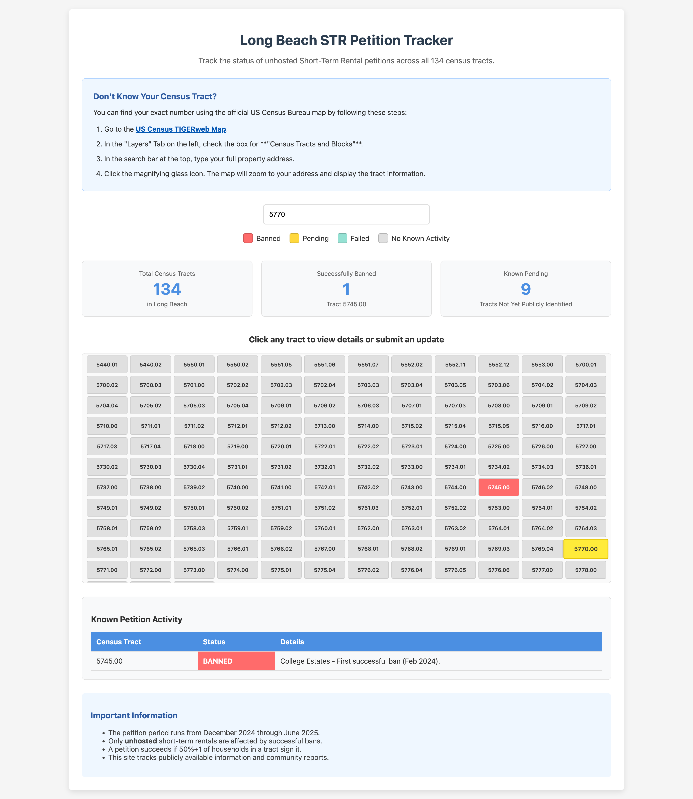

# Long Beach STR Petition Tracker

This is a free tool for Long Beach residents and property owners. It helps you check the status of short-term rental (STR) petitions in the city. You can see which areas have banned unhosted STRs or have active petitions.

## Live Site

You can use the live tool here: [https://longbeach-str-tracker.onrender.com/](https://longbeach-str-tracker.onrender.com/)

## Screenshot

## Features

* See all 134 census tracts in Long Beach in a grid.
* Check the current status of STR petitions (banned, pending, etc.).
* Search for your specific tract number.
* Submit updates about petition activity in your area.
* Includes instructions on how to find your census tract number.

## How It Was Built

I built this entire project with Google's Gemini.

The tech stack is:
* **Frontend:** HTML, CSS, and JavaScript with Vite.
* **Backend:** A simple Node.js and Express API.
* **Hosting:** The frontend and backend are both hosted on Render.
* **Database:** A Google Sheet, which is updated via the Google Sheets API.

## Future Ideas

Here are some possible updates for the future:
* Add an interactive map view of all tracts.
* Read the tract statuses directly from the Google Sheet.
* Show a history of status changes for each tract.

## License

This project uses the MIT License. See the `LICENSE` file for more details.